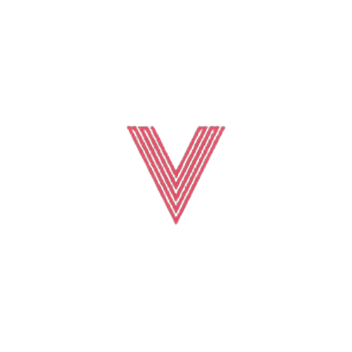

<h1></h1>
<h1 algin = Center></h1>
<h3 align = Center>VAYZIO</h3>

> Vayzio ist ein Allgemeiner Bot der auf der Sprache Python basiert.
> Der Bot wird ab dem `02.02.2024` öffentlich sein.
> Vayzio Wird bis zu 100+ Befehle/Commands besitzen.

<h3 align = Center>

  [Invite](https://discord.com/api/oauth2/authorize?client_id=971347959788765237&permissions=8&scope=bot)
</h3>

  <a href="#Commands">Commands</a>
  •
  <a href="#Settings">Settings</a>
  •
  <a href="#Features">Features</a>
  •
  <a href="#plugins">Plugins</a>
  •
  <a href="#support">Support</a>
  •
  <a href="#update">Update</a>
<h1></h1>

<h2 align="center">🧿 Commands 🧿</h2>

> `v!help`
> 
> `v!invite`

<h2 align="center">🛠️ Settings 🛠️</h2>

> Prefix : `v!`
> 
> Version : `0.0.1-Beta`

<h2 align="center">🚀 Features 🚀</h2>

> `Automod`,
> `Moderation`,
> `Giveaways`,
> `Fun`,
> `Ticketsystem`,
> `Utlis`,
> `Welcomer`,
> `AutoRoles`,
> `Banwords`,
> `Invitedeleter`

<h2 align="center">➕ Plugins ➕</h2>

> [Github]()

<h2 algin="center">⚙️ Developer ⚙️</h2>

> Main-Developer: Noozq `aka` basti.kha

> Sup-Developer: `-`

<h2 align="center">🚔 Support 🚔</h2>

> [Discord](https://discord.gg/WjYrRvZM9Q) 

> [Website](https://soon.de/)

<h2 align="center">🔮 Update 🔮</h2>

[+] `Changename`
